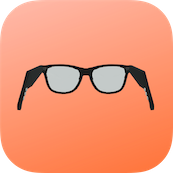
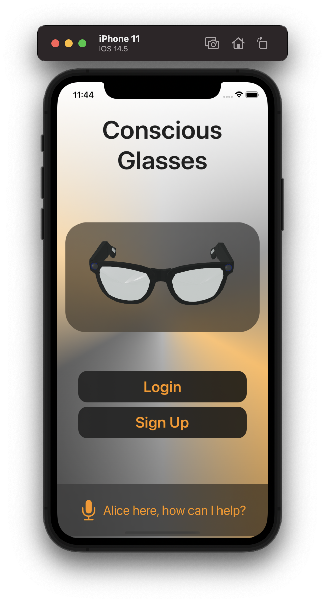
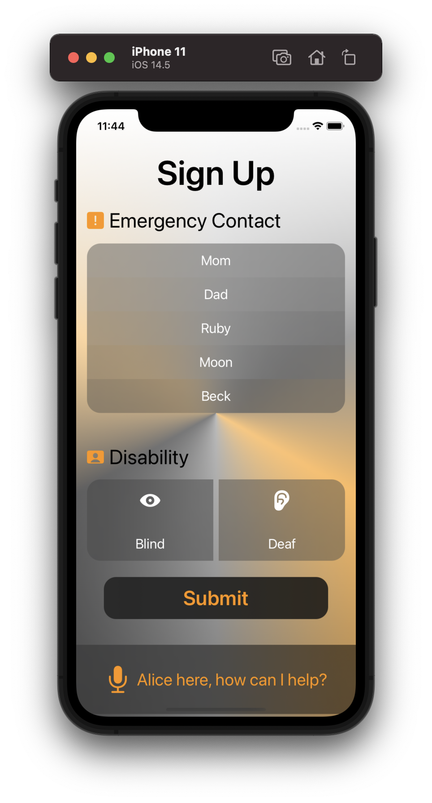
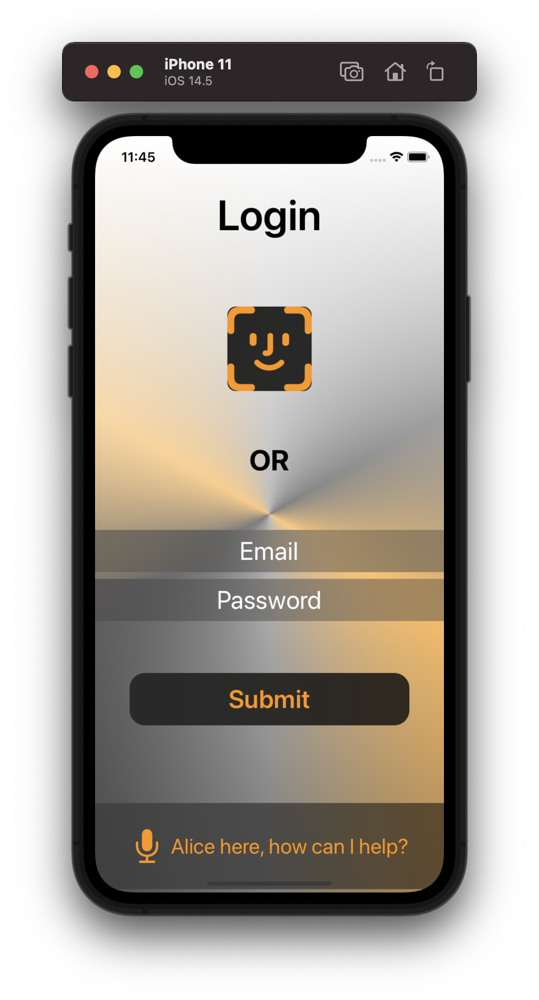
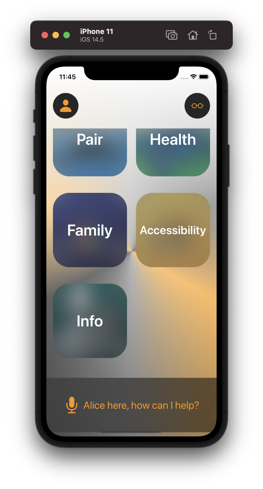
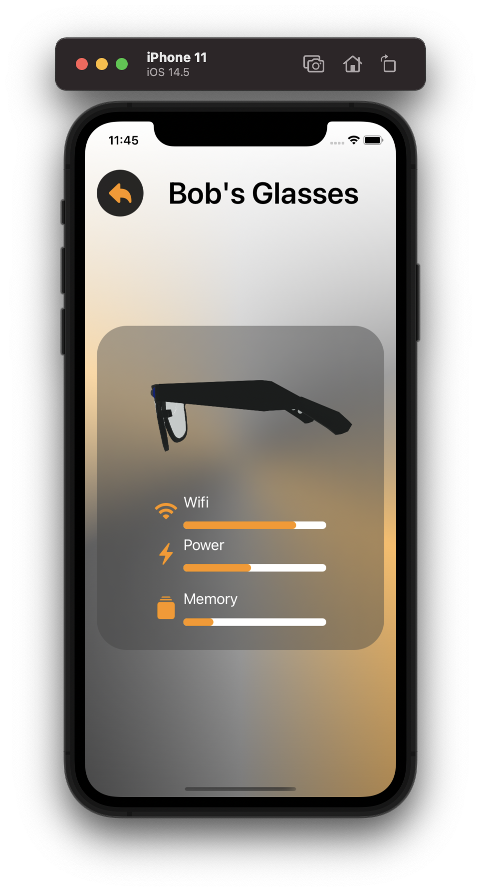

# Conscious Glasses Application

  

Created this application as part of a Hackathon organised by Estée Lauder Companies. The aim was to develop accessible and inclusive solutions to help tackle challenges that people with disabilities face on a daily basis.

## Demo

Demo Video in the file structure

## Screenshots

